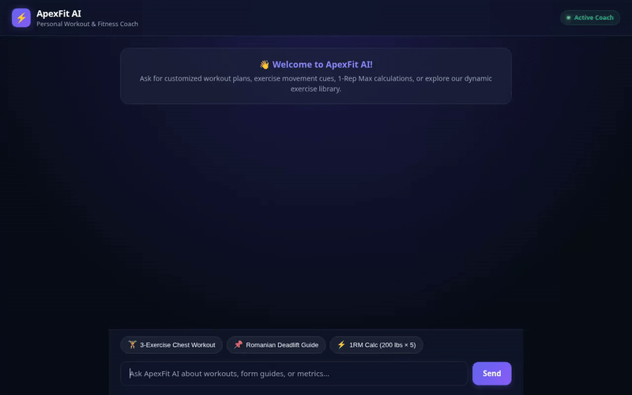

# ApexFit AI — Intelligent Personal Workout & Fitness Coach 🏋️‍♂️

ApexFit AI is an autonomous, personalized fitness coach agent built with the **Google Agent Development Kit (ADK)** and deployed on **Google Cloud Agent Platform**. It delivers tailored workout plans, dynamic exercise lookups, fitness metric calculations, nearby gym discovery, AI-generated exercise form images, and AI-generated exercise movement videos—all presented through interactive **A2UI (Agent-to-User Interface)** components.



---

## 🌟 Key Features & Architecture

ApexFit AI integrates a suite of Google Cloud and Gemini AI technologies:

* **🧠 Memory Bank Context**: Remembers user preferences, injuries, personal records (PRs), and fitness goals across sessions using ADK's `PreloadMemoryTool` and `generate_memories_callback`.
* **📚 Dynamic Firestore Exercise Library**: Queries, inspects, and adds custom exercise definitions directly from Cloud Firestore (`exercises` collection).
* **🎥 Gemini Omni Exercise Video Generation**: Generates short exercise movement and technique videos using `gemini-omni-flash-preview` in Vertex AI's `global` region, saving local Playground artifacts and uploading public MP4 video assets to Google Cloud Storage (`apexfit-media-7b89`).
* **🎨 Gemini Flash-Lite Image Generation**: Synthesizes custom exercise form illustrations using Imagen / `gemini-3.1-flash-lite-preview`, uploading public images to Cloud Storage.
* **📱 Rich A2UI Version 0.8 Interface**: Formats responses into structured card layouts (Cards, Columns, Rows, Text, and Images) rendered seamlessly in both the ADK Playground and web proxy client.
* **⚡ Secure Agent Engine Code Execution**: Executes custom Python code safely inside an `AgentEngineSandboxCodeExecutor` sandbox for complex 1RM, macro, and body composition math.
* **📍 Google Maps & Places Integration**: Geocodes user locations and finds nearby fitness centers, gyms, and sports parks using Google Maps & Places APIs.
* **🥗 Nutrition & Calorie Lookup**: Calculates nutritional breakdowns and calorie targets for meals.

---

## 🛠️ Project Structure

```
apexfit-agent/
├── app/
│   ├── agent.py                 # Main ADK Agent definition, callbacks & system prompt
│   ├── a2ui_utils.py            # A2UI v0.8 schema manager & surface callback
│   └── tools/
│       ├── video_generator.py   # Gemini Omni exercise video generator & GCS uploader
│       ├── image_generator.py   # Exercise image generator & GCS uploader
│       ├── exercise_db.py       # Cloud Firestore exercise catalog tools
│       ├── fitness_calc.py      # Fitness metric calculators (BMI, BMR, 1RM)
│       ├── maps_tools.py        # Google Maps geocoding & nearby places lookup
│       ├── memory_tool.py       # Memory Bank preloader tool
│       └── nutrition_tool.py    # Nutrition & calorie lookup tool
├── frontend/
│   ├── main.py                  # FastAPI proxy server for A2A agent runtime
│   └── static/
│       ├── index.html           # Dark glassmorphism ApexFit AI chat interface
│       ├── app.js               # A2UI renderer & client-side chat handler
│       └── styles.css           # Styling & design system
├── agents-cli-manifest.yaml     # Agent deployment manifest
├── demo.gif                     # Demo recording
└── README.md
```

---

## 🚀 Setup & Local Running

### Prerequisites

* Python 3.10+
* `agents-cli` installed
* Authenticated `gcloud` session with Application Default Credentials (`gcloud auth application-default login`)

### 1. Run the Agent Locally

```bash
# Start local agent server
agents-cli run --mode a2a
```

### 2. Run the Custom Web Frontend Proxy

```bash
# Set environment variables
export AGENT_ENGINE_RESOURCE_NAME="projects/<PROJECT_ID>/locations/<LOCATION>/reasoningEngines/<ENGINE_ID>"
export AGENT_DIRECTORY="app"
export PORT=8080

# Start FastAPI frontend
python frontend/main.py
```

Open your web browser at `http://localhost:8080` to interact with ApexFit AI.

---

## 🛡️ License

Apache License 2.0
